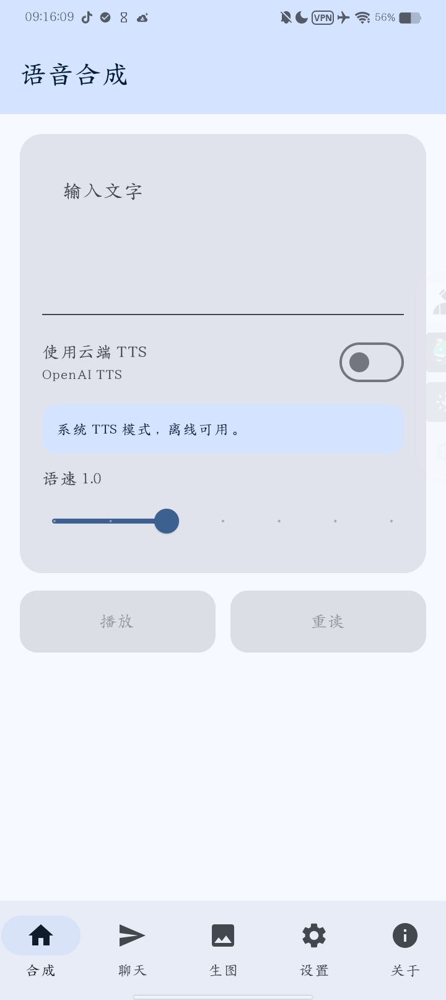
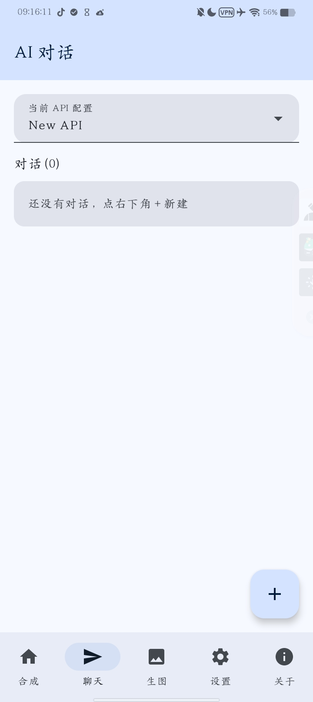
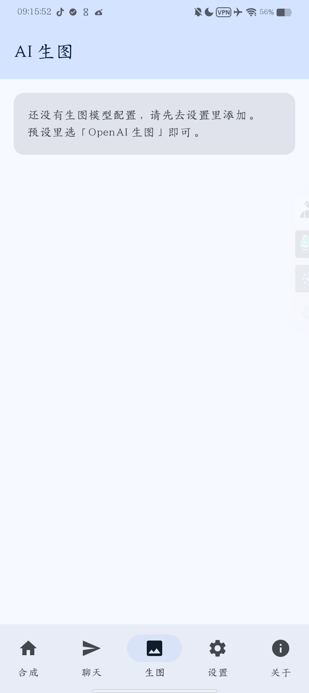
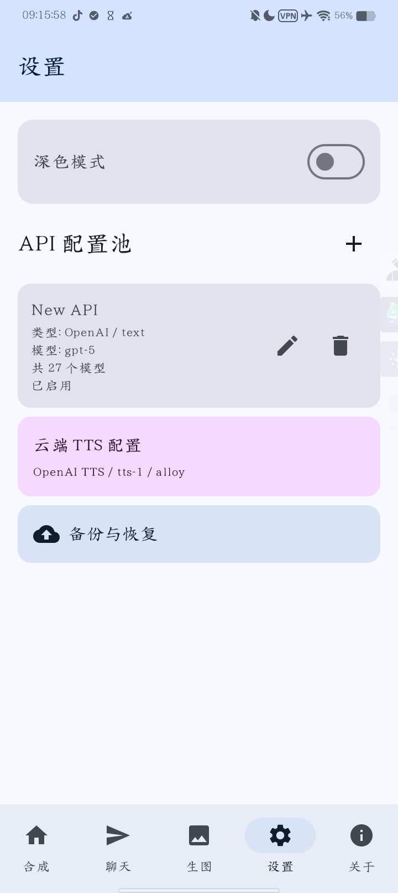
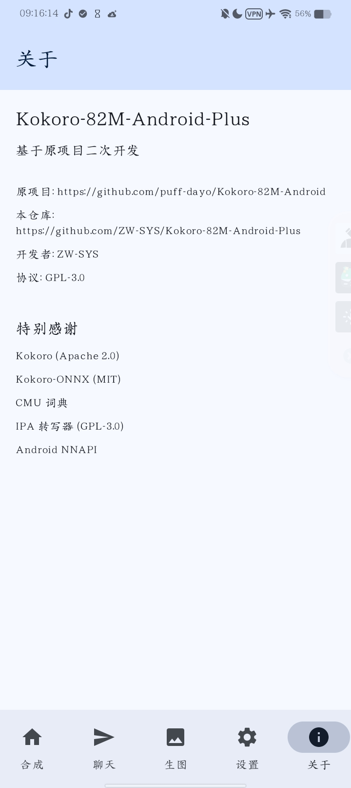

# Kokoro-82M-Android-Plus

基于 [puff-dayo/Kokoro-82M-Android](https://github.com/puff-dayo/Kokoro-82M-Android) 二次开发的安卓语音合成与 AI 对话应用。

原项目是 Kokoro-82M 本地 TTS 引擎的安卓演示，只支持英文，中文报错，UI 基础。本项目在原项目基础上进行了大幅改造，把 TTS 引擎换成了安卓系统 TTS（支持中文），并加入了多提供商 AI 对话、生图、文件上传、会话管理、备份恢复、云端 TTS 等功能。

---

## 界面预览

### 语音合成



支持系统 TTS 和云端 TTS 两种模式，可调节语速，一键播放。

### AI 聊天



支持 11 种 AI 提供商，会话管理，模型切换，图片与文件上传。

### AI 生图



独立生图页面，支持 OpenAI 兼容的生图接口。

### 设置



管理多个 AI API 配置，支持测试连接和自动获取模型列表。底部可进入云端 TTS 配置和备份恢复。

### 关于



项目信息、开源协议和特别感谢。

---

## 功能特性

### 语音合成

- 系统 TTS：调用安卓系统自带引擎，支持中文，离线可用
- 云端 TTS：兼容 OpenAI `/v1/audio/speech` 接口，音质更好，音色可选，API Key 可留空
- 语速调节：0.5x ~ 2.0x
- 一键播放

### AI 对话

支持 11 种 AI 提供商：

| 提供商 | 类型 | 默认模型 |
|---|---|---|
| DeepSeek | OpenAI 兼容 | deepseek-chat |
| OpenAI 聊天 | OpenAI 兼容 | gpt-4o-mini |
| OpenAI 生图 | 生图 | dall-e-3 |
| Google Gemini | Gemini 原生 | gemini-1.5-flash |
| OpenRouter | OpenAI 兼容 | openai/gpt-3.5-turbo |
| Claude | Claude 原生 | claude-3-haiku |
| Ollama | 本地部署 | llama3 |
| 阿里云百炼 | OpenAI 兼容 | qwen-turbo |
| Moonshot | OpenAI 兼容 | moonshot-v1-8k |
| 智谱 | OpenAI 兼容 | glm-4 |
| xAI | OpenAI 兼容 | grok-1 |
| 自定义 | OpenAI / Gemini / Claude / Ollama | 手动填写 |

主要能力：

- API 配置池：添加、编辑、删除多个配置，自由切换
- 测试连接：发送测试消息验证 API 可用性
- 自动获取模型：从 API 拉取可用模型列表并保存
- 模型类型分类：纯文本 / 多模态 / 生图，界面按类型显示对应按钮
- 会话管理：新建、重命名、删除独立对话
- 对话内切换模型：顶部下拉随时切换
- 消息自动保存：对话内容自动持久化
- 文件上传：文本文件直接读取，PDF 转图片，图片以 base64 发送，多模态模型可识别

### AI 生图

- 独立页面，支持 OpenAI `/v1/images/generations` 兼容接口
- 输入描述生成图片
- 显示 base64 结果或 URL

### 备份与恢复

- 本地备份：导出 JSON 文件，可通过系统分享保存
- 本地恢复：从 JSON 文件导入
- Web 备份：上传到指定 Web 地址（支持 API Key 鉴权）
- Web 恢复：从指定地址下载并恢复

### 界面

- 卡片式布局，圆角风格
- 深色模式，一键切换
- 页面切换淡入动画，消息和列表项淡入 + 上滑

---

## 与原项目的区别

| 项目 | 原项目 | 本项目 |
|---|---|---|
| TTS 引擎 | Kokoro-82M 本地模型 | 系统 TTS + 云端 TTS |
| 中文支持 | 不支持 | 支持 |
| AI 对话 | 无 | 支持 11 种提供商 |
| AI 生图 | 无 | 支持 |
| 会话管理 | 无 | 支持新建、重命名、删除 |
| 文件上传 | 无 | 支持文本 / PDF / 图片 |
| 备份恢复 | 无 | 本地 + Web |
| 深色模式 | 无 | 支持 |
| 界面 | 基础 | 卡片式布局 + 动画 |
| 语言 | 英文 | 中文 |

原项目的 Kokoro 引擎相关文件（ModelManager、PhonemeConverter、Tokenizer 等）已在本项目中移除，改为使用系统 TTS。

---

## 技术栈

- 语言：Kotlin 2.0
- UI：Jetpack Compose + Material 3
- 网络：OkHttp 4.12
- 异步：Kotlin Coroutines
- 序列化：Android 内置 org.json
- TTS：Android TextToSpeech API + MediaPlayer

---

## 开发环境

- Android Studio 或 Termux
- Kotlin 2.0
- JDK 17
- Android SDK 34
- Min SDK 26
- Target SDK 34

---

## 编译与安装

### 方式一：GitHub Actions 云端编译

本项目已配置 GitHub Actions，推送到 master 分支后自动构建。

1. 查看构建状态：https://github.com/ZW-SYS/Kokoro-82M-Android-Plus/actions
2. 构建完成后，点进绿色的运行记录，页面底部 Artifacts 区域下载 app-debug.zip
3. 解压得到 app-debug.apk，传到手机安装

### 方式二：本地编译

```
git clone https://github.com/ZW-SYS/Kokoro-82M-Android-Plus.git
cd Kokoro-82M-Android-Plus
./gradlew assembleDebug
```

生成的 APK 位于 `app/build/outputs/apk/debug/app-debug.apk`。

---

## 项目结构

```
app/src/main/java/com/example/kokoro82m/
├── MainActivity.kt                主入口，所有界面
├── screens/
│   └── HistoryScreen.kt           历史记录页
└── utils/
    ├── ApiService.kt              AI 请求与 API 配置存储
    ├── BackupHelper.kt            本地与 Web 备份
    ├── ChatHistoryRepository.kt   会话数据存储
    ├── FileHelper.kt              文件读取与转换
    ├── HistoryRepository.kt       历史记录存储
    └── TtsService.kt              云端 TTS 服务
```

---

## 开源协议

GPL-3.0

本项目基于 [puff-dayo/Kokoro-82M-Android](https://github.com/puff-dayo/Kokoro-82M-Android) 二次开发，遵循 GPL-3.0 协议开源。任何基于本项目的衍生作品也必须以 GPL-3.0 协议开源。

---

## 特别感谢

- [Kokoro](https://huggingface.co/hexgrad/Kokoro-82M) (Apache 2.0)
- [Kokoro-ONNX](https://huggingface.co/onnx-community/Kokoro-82M-v1.0-ONNX) (MIT)
- CMU 词典
- IPA 转写器 (GPL-3.0)
- Android NNAPI
- [puff-dayo](https://github.com/puff-dayo) — 原项目作者

---

## 开发者

ZW-SYS