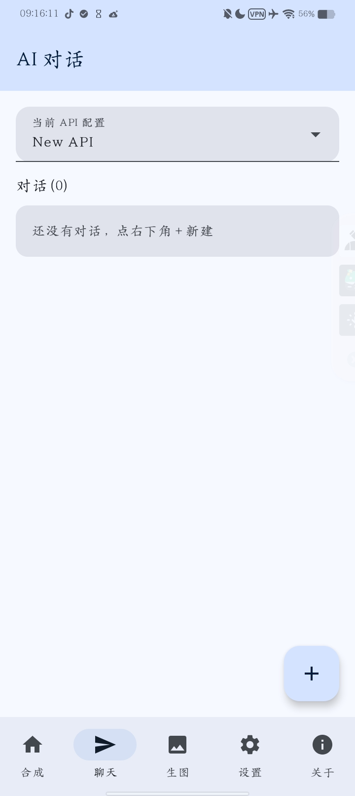
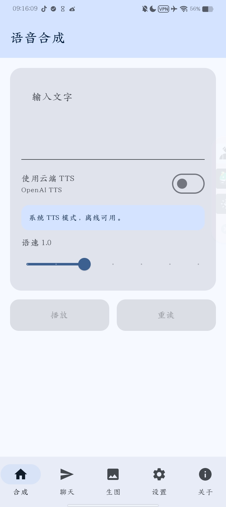
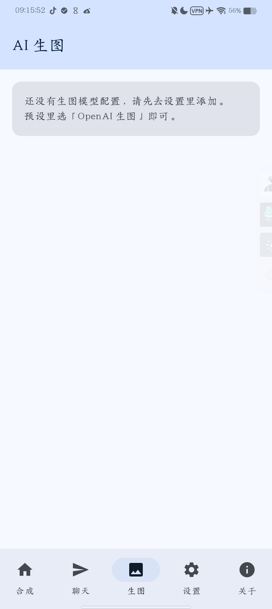
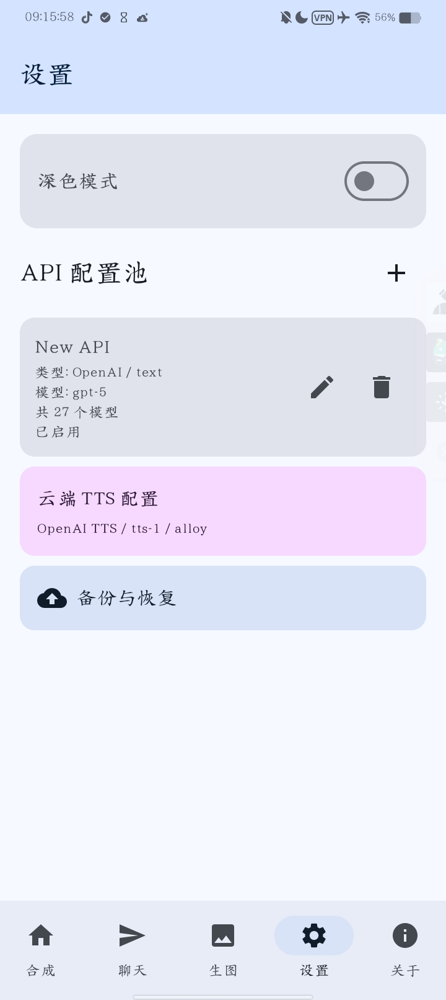
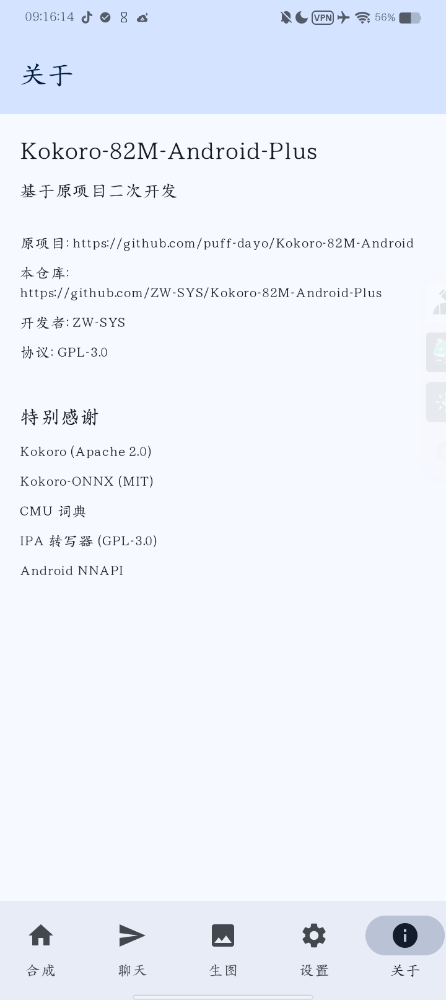

# Kokoro-82M-Android-Plus

基于 [puff-dayo/Kokoro-82M-Android](https://github.com/puff-dayo/Kokoro-82M-Android) 二次开发的安卓语音合成与 AI 对话应用。

原项目是 Kokoro-82M 本地 TTS 引擎的安卓演示，只支持英文，中文报错，UI 基础。本项目在原项目基础上进行了大幅改造，把 TTS 引擎换成了安卓系统 TTS（支持中文），并加入了多提供商 AI 对话、生图、文件上传、会话管理、备份恢复、云端 TTS、Agent 工具等功能。

---

## 目录

- [界面预览](#界面预览)
- [功能特性](#功能特性)
- [架构设计](#架构设计)
- [数据存储](#数据存储)
- [Agent 工具系统](#agent-工具系统)
- [编译与安装](#编译与安装)
- [二次开发指南](#二次开发指南)
- [常见问题](#常见问题)
- [开源协议](#开源协议)

---

## 界面预览

### AI 聊天



主页默认进入 AI 对话，根据时间显示问候语。支持 11 种 AI 提供商，会话管理，模型切换，图片与文件上传。

### 语音合成



支持系统 TTS 和云端 TTS 两种模式，可调节语速，一键播放。

### AI 生图



独立生图页面，支持 OpenAI 兼容的生图接口。

### 设置



管理多个 AI API 配置，支持测试连接和自动获取模型列表。底部可进入云端 TTS 配置和备份恢复。

### 关于



项目信息、开源协议和特别感谢。

---

## 功能特性

### 界面

- **Material Design 3** 主题，支持动态取色（Android 12+），固定蓝紫兜底
- **侧边栏导航**：左上角菜单按钮，侧滑展示所有页面
- **主页时间问候**：早上好 / 中午好 / 下午好 / 晚上好 / 别熬夜了
- **深色模式**：一键切换，实时生效
- 卡片式布局，页面切换动画，消息淡入 + 上滑

### AI 对话

支持 11 种 AI 提供商：

| 提供商 | 类型 | 默认模型 |
|---|---|---|
| DeepSeek | OpenAI 兼容 | deepseek-chat |
| OpenAI 聊天 | OpenAI 兼容 | gpt-4o-mini |
| OpenAI 生图 | 生图 | dall-e-3 |
| Google Gemini | Gemini 原生 | gemini-1.5-flash |
| OpenRouter | OpenAI 兼容 | openai/gpt-3.5-turbo |
| Claude | Claude 原生 | claude-3-haiku |
| Ollama | 本地部署 | llama3 |
| 阿里云百炼 | OpenAI 兼容 | qwen-turbo |
| Moonshot | OpenAI 兼容 | moonshot-v1-8k |
| 智谱 | OpenAI 兼容 | glm-4 |
| xAI | OpenAI 兼容 | grok-1 |
| 自定义 | OpenAI / Gemini / Claude / Ollama | 手动填写 |

主要能力：

- **API 配置池**：添加、编辑、删除多个配置，自由切换
- **测试连接**：发送测试消息验证 API 可用性
- **自动获取模型**：从 API 拉取可用模型列表并保存
- **模型类型分类**：纯文本 / 多模态 / 生图
- **会话管理**：新建、重命名、删除独立对话
- **对话内切换模型**：顶部下拉随时切换
- **消息自动保存**：对话内容自动持久化
- **文件上传**：文本文件直接读取，PDF 转图片，图片以 base64 发送

### Agent 工具

内置 8 个本地工具，AI 可通过控制块自主调用：

| 工具 | 说明 | 需要权限 |
|---|---|---|
| get_current_time | 获取设备本地当前时间 | 无 |
| read_file | 读取文件 | 存储 |
| write_file | 写入文件 | 存储 |
| network_request | 发起 HTTP/HTTPS 请求 | 网络 |
| open_app | 按包名启动应用 | 无 |
| list_apps | 列出已安装应用 | 包查询 |
| app_info | 查询应用信息 | 包查询 |
| uninstall_app | 打开系统卸载确认页 | 无 |

工具调用协议说明见 [Agent 工具系统](#agent-工具系统)。

### 语音合成

- **系统 TTS**：调用安卓系统自带引擎，支持中文，离线可用
- **云端 TTS**：兼容 OpenAI `/v1/audio/speech` 接口，音质更好，音色可选，API Key 可留空
- **语速调节**：0.5x ~ 2.0x

### AI 生图

- 独立页面，支持 OpenAI `/v1/images/generations` 兼容接口
- 输入描述生成图片
- 显示 base64 结果或 URL

### 备份与恢复

- **本地备份**：导出 JSON 文件，通过系统分享保存
- **本地恢复**：从 JSON 文件导入
- **Web 备份**：上传到指定地址（支持 API Key 鉴权）
- **Web 恢复**：从指定地址下载并恢复

---

## 架构设计

### 项目结构

```
app/src/main/java/com/example/kokoro82m/
├── MainActivity.kt                主入口，所有 Compose 界面
├── MyApplication.kt               自定义 Application（动态取色）
├── screens/
│   └── AboutScreen.kt             关于页辅助组件
├── ui/theme/
│   ├── Color.kt                   MD3 配色（动态取色 + 蓝紫兜底）
│   ├── Theme.kt                   主题配置
│   └── Type.kt                    字体（暂未使用）
└── utils/
    ├── AgentTools.kt              Agent 工具系统（协议 + 执行 + 配置）
    ├── ApiService.kt              AI 请求与 API 配置存储
    ├── BackupHelper.kt            本地与 Web 备份
    ├── ChatHistoryRepository.kt   会话数据存储
    ├── FileHelper.kt              文件读取与转换
    ├── HistoryRepository.kt       历史记录存储（旧版本遗留）
    └── TtsService.kt              云端 TTS 服务
```

### 分层结构

```
┌─────────────────────────────────────────┐
│  UI 层（Compose）                        │
│  MainActivity.kt                        │
│  - MainScreen（侧边栏容器）              │
│  - SessionListScreen（对话列表）         │
│  - ChatDetailScreen（对话详情）          │
│  - BasicScreen（语音合成）               │
│  - ImageGenScreen（生图）                │
│  - ToolsScreen（工具开关）               │
│  - SettingsScreen（设置）                │
│  - AboutScreen（关于）                   │
└─────────────────┬───────────────────────┘
                  │
┌─────────────────▼───────────────────────┐
│  业务层                                  │
│  - ApiService（网络请求）                │
│  - AgentToolExecutor（工具执行）         │
│  - TtsService（TTS 播放）                │
│  - BackupHelper（备份恢复）              │
└─────────────────┬───────────────────────┘
                  │
┌─────────────────▼───────────────────────┐
│  数据层                                  │
│  - ChatHistoryRepository（会话）         │
│  - ApiProfileStore（API 配置）           │
│  - TtsProfileStore（TTS 配置）           │
│  - AgentToolConfig（工具开关）           │
│  - FileHelper（文件 IO）                 │
└─────────────────────────────────────────┘
```

### 状态管理

项目**没有使用 ViewModel**，所有状态用 Compose 的 `remember { mutableStateOf(...) }` 管理。这是为了简化项目，代价是：

- **优点**：代码集中，阅读容易
- **缺点**：配置变化（如旋转屏幕）会丢失状态，MainActivity 会重新创建

如果要改进，可以引入 ViewModel + StateFlow，但会增加项目复杂度。

---

## 数据存储

### 存储位置

所有数据存在 `Android/data/com.example.kokoro82m/` 下：

| 文件 | 路径 | 内容 |
|---|---|---|
| 会话数据 | `files/chat_sessions.json` | 所有对话和消息 |
| API 配置 | `shared_prefs/kokoro_api_profiles.xml` | AI API 配置池 |
| TTS 配置 | `shared_prefs/kokoro_tts_profile.xml` | 云端 TTS 配置 |
| 工具开关 | `shared_prefs/kokoro_agent_tools.xml` | Agent 工具启用状态 |
| 设置项 | `shared_prefs/kokoro_settings.xml` | 深色模式等 |

### 数据结构

**会话数据**（`chat_sessions.json`）：

```json
[
  {
    "id": "uuid",
    "name": "对话名称",
    "profileId": "关联的API配置ID",
    "model": "使用的模型",
    "messages": [
      {
        "role": "user",
        "content": "消息内容",
        "imageBase64": null,
        "imageMimeType": null,
        "attachments": [
          {
            "type": "image",
            "mimeType": "image/jpeg",
            "base64": "...",
            "name": "image.jpg"
          }
        ]
      }
    ],
    "createdAt": 1728000000000,
    "updatedAt": 1728000000000
  }
]
```

**API 配置**（`kokoro_api_profiles.xml`，以 JSON 字符串存储）：

```json
[
  {
    "id": "uuid",
    "name": "DeepSeek",
    "providerType": "OpenAI",
    "modelType": "text",
    "baseUrl": "https://api.deepseek.com/v1/chat/completions",
    "imageUrl": "",
    "apiKey": "sk-xxx",
    "model": "deepseek-chat",
    "models": ["deepseek-chat", "deepseek-reasoner"],
    "enabled": true
  }
]
```

### 备份格式

`BackupHelper` 导出的 JSON 包含所有配置：

```json
{
  "version": 1,
  "exported_at": 1728000000000,
  "api_profiles": [...],
  "tts_profile": {...},
  "chat_sessions": [...]
}
```

---

## Agent 工具系统

### 工作原理

工具调用采用**控制块协议**：

1. **AI 生成控制块**：模型在回复里嵌入 JSON 控制块
2. **解析**：`AgentToolProtocol.parse()` 扫描控制块标记，提取工具调用
3. **执行**：`AgentToolExecutor` 逐个执行工具
4. **回注**：把结果包成 tool 消息塞回对话
5. **循环**：AI 收到结果后继续生成，最多 5 轮

### 控制块格式

```
[[KOKORO_TOOLS_V1]]
{"call":{"id":"t1","tool":"get_current_time"}}
[[/KOKORO_TOOLS_V1]]
```

批量调用：

```
[[KOKORO_TOOLS_V1]]
{"calls":[
  {"id":"t1","tool":"get_current_time"},
  {"id":"t2","tool":"list_apps"}
]}
[[/KOKORO_TOOLS_V1]]
```

### 约束

| 参数 | 值 |
|---|---|
| 单次最大工具调用数 | 4 |
| 控制块最大 JSON 长度 | 48 KB |
| 最大工具调用轮数 | 5 |

### 路径权限

`read_file` 和 `write_file` **仅限**以下目录：

- `Download/` 目录
- `Android/data/com.example.kokoro82m/` 下所有文件
- App 私有目录

**越界路径会直接拒绝，返回错误**。

### 添加新工具

在 `AgentTools.kt` 里：

1. 把工具名加进 `AgentToolConfig.ALL_TOOLS` 列表
2. 在 `AgentToolConfig.TOOL_DESCRIPTIONS` 里加描述
3. 在 `AgentToolPrompt.appendToolSchema()` 里加参数说明
4. 在 `AgentToolExecutor.execute()` 的 `when` 分支里加处理函数

---

## 编译与安装

### 方式一：GitHub Actions 云端编译

推送到 master 分支后自动构建。

1. 查看构建状态：https://github.com/ZW-SYS/Kokoro-82M-Android-Plus/actions
2. 构建完成后，点进绿色的运行记录，页面底部 Artifacts 区域下载 app-debug.zip
3. 解压得到 app-debug.apk，传到手机安装

**注意**：项目使用固定签名，签名文件通过 GitHub Secrets 注入。如果需要自己发布，参照 [二次开发指南](#二次开发指南) 配置签名。

### 方式二：本地编译

```
git clone https://github.com/ZW-SYS/Kokoro-82M-Android-Plus.git
cd Kokoro-82M-Android-Plus
./gradlew assembleDebug
```

生成的 APK 位于 `app/build/outputs/apk/debug/app-debug.apk`。

### 环境要求

| 依赖 | 版本 |
|---|---|
| JDK | 17 |
| Android SDK | 34 |
| Kotlin | 2.0 |
| Gradle | 8.10.2（项目自带 wrapper） |

---

## 二次开发指南

### 修改 UI

**所有界面**在 `MainActivity.kt` 里。想改哪个页面，直接找到对应的 `@Composable` 函数：

- `MainScreen` —— 侧边栏 + 页面容器
- `SessionListScreen` —— 对话列表
- `ChatDetailScreen` —— 对话详情（消息列表 + 输入框）
- `BasicScreen` —— 语音合成
- `ImageGenScreen` —— 生图
- `ToolsScreen` —— 工具开关
- `SettingsScreen` —— 设置
- `AboutScreen` —— 关于

配色在 `ui/theme/Color.kt`，主题在 `ui/theme/Theme.kt`。

### 修改 AI 提供商

在 `ApiService.kt` 顶部的 `AiProviders.presets` 列表里加新条目。

每个条目包含：

- `name`：显示名称
- `providerType`：请求格式（`OpenAI` / `Gemini` / `Claude` / `Ollama`）
- `modelType`：`text` / `multimodal` / `image`
- `baseUrl`：API 端点
- `imageUrl`：生图端点（只有生图类型需要）
- `defaultModel`：默认模型
- `models`：预设模型列表

### 添加新工具

见 [Agent 工具系统 - 添加新工具](#添加新工具)。

### 自定义签名

**本地生成 keystore**：

```bash
keytool -genkey -v -keystore release.jks \
  -keyalg RSA -keysize 2048 -validity 10000 \
  -alias your_alias \
  -storepass your_store_password \
  -keypass your_key_password \
  -dname "CN=Your Name, OU=Dev, O=Your Org, L=City, S=State, C=CN"
```

**转 base64**：

```bash
base64 release.jks > release.jks.base64
```

**在 GitHub 配置 Secrets**（Settings → Secrets and variables → Actions）：

| Secret 名 | 值 |
|---|---|
| `KEYSTORE_BASE64` | release.jks.base64 的内容 |
| `KEYSTORE_PASSWORD` | your_store_password |
| `KEY_ALIAS` | your_alias |
| `KEY_PASSWORD` | your_key_password |

`build.gradle.kts` 已经写好了读取这些环境变量的逻辑。

### 修改包名

如果想把 `com.example.kokoro82m` 改成自己的包名，需要在：

1. `app/build.gradle.kts` 的 `namespace` 和 `applicationId`
2. `app/src/main/AndroidManifest.xml` 的 `package`（如果有）
3. 所有 `.kt` 文件的 `package` 声明
4. 所有 `import com.example.kokoro82m.xxx` 的引用

**推荐用 Android Studio 的 Refactor → Rename Package，手改容易漏。**

---

## 常见问题

### Q：为什么装新版必须卸载旧版？

**A**：签名不一致。项目使用固定签名，如果你从别人那儿拿的 APK 跟你自己编译的签名不同，系统会拒绝覆盖安装。

**解决**：卸载旧版再装新版，或统一使用同一套签名。

### Q：AI 回复是空的 / 报错？

**A**：按顺序检查：

1. **API 配置是否正确**：设置 → 点配置 → 测试连接
2. **模型是否选中**：对话页顶部点模型名，选一个
3. **模型是否可用**：某些模型的 API Key 需要单独付费
4. **网络是否通畅**：如果用了境外 API，需要 VPN

### Q：工具调用不生效？

**A**：按顺序检查：

1. **工具主开关是否打开**：工具页 → 启用 Agent 工具
2. **具体工具是否启用**：工具页 → 逐个开关
3. **模型是否支持工具调用**：GPT-4o、Claude 3、DeepSeek 都支持，但一些小模型不支持
4. **看状态提示**：发送时状态栏会显示「执行工具: xxx」，如果一直不显示，说明模型没输出控制块

### Q：云端 TTS 不播放？

**A**：

1. **Base URL 是否正确**：必须是 `/v1/audio/speech` 结尾
2. **API Key 是否需要**：有些公开 TTS 服务不需要 Key，留空即可
3. **合成页是否打开了「使用云端 TTS」开关**
4. **看 Toast 提示**：失败会显示 HTTP 错误码

### Q：数据存在哪里？怎么备份？

**A**：所有数据在 `Android/data/com.example.kokoro82m/`，但 Android 11+ 普通文件管理器看不到。

**用 App 内置的备份功能**：设置 → 备份与恢复 → 导出。会生成 JSON 文件，可以自己保存或上传。

### Q：能加中文以外的语言吗？

**A**：当前版本只有中文。要做国际化需要：

1. 把所有硬编码中文提取到 `strings.xml`
2. 创建 `values-en/strings.xml`
3. 代码里用 `stringResource(R.string.xxx)`

**这是个独立的大工程，暂未实现。**

---

## 开源协议

GPL-3.0

本项目基于 [puff-dayo/Kokoro-82M-Android](https://github.com/puff-dayo/Kokoro-82M-Android) 二次开发，遵循 GPL-3.0 协议开源。任何基于本项目的衍生作品也必须以 GPL-3.0 协议开源。

---

## 特别感谢

- [Kokoro](https://huggingface.co/hexgrad/Kokoro-82M) (Apache 2.0)
- [Kokoro-ONNX](https://huggingface.co/onnx-community/Kokoro-82M-v1.0-ONNX) (MIT)
- CMU 词典
- IPA 转写器 (GPL-3.0)
- Android NNAPI
- [puff-dayo](https://github.com/puff-dayo) — 原项目作者

---

## 开发者

ZW-SYS